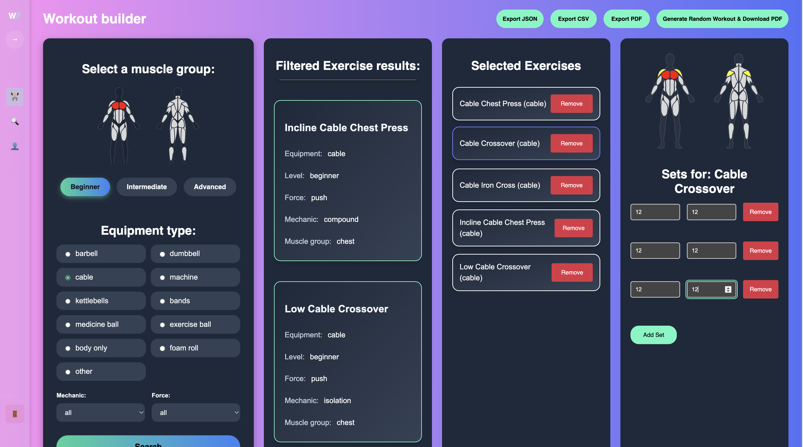

# Workout Flow - Installatiehandleiding

## Inleiding

Workout Flow is een React-gebaseerde webapplicatie voor het bouwen en beheren van workouts. De applicatie gebruikt Vite als development server en build tool.



## Benodigdheden
Om deze applicatie lokaal te draaien, heb je het volgende nodig:

- Node.js (versie 20.0.0 of hoger)
- npm
- Git

## Installatie-instructies
Volg deze stappen om de applicatie op jouw machine te installeren en te starten:

1. **Clone of download het project**
   ```bash
   git clone https://github.com/Devivdb/workout-flow-webapp.git
   cd workout-flow-webapp
   ```

2. **Installeer de dependencies**
   ```bash
   npm install
   ```

3. **Environment setup**
   Plaats het `.env` bestand dat je lokaal hebt ontvangen in de root directory van het project. Dit bestand bevat alle benodigde API credentials en configuratie.

4. **Start de ontwikkelserver**
   ```bash
   npm run dev
   ```

## Inloggegevens

Voor het testen van de applicatie heb je een account nodig. Je kunt:
- Een nieuw account aanmaken via de registratiepagina

## Extra npm commando's
De applicatie bevat de volgende extra npm-commando's:

- **Applicatie bouwen (voor productie):**
  ```bash
  npm run build
  ```

- **Server starten voor productie-build:**
  ```bash
  npm run preview
  ```

- **Linting uitvoeren:**
  ```bash
  npm run lint
  ```

## Conclusie

De applicatie biedt functionaliteiten zoals workout builder, exercise finder, PDF/CSV/JSON export, muscle group visualizer en persoonlijk profiel.

## Link naar Github repository

[Workout Flow Repository](https://github.com/Devivdb/workout-flow-webapp)